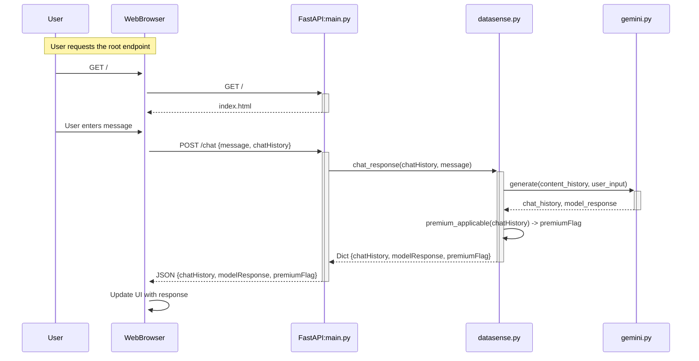

# Steps to setup the app locally/withon cloudtop:

1. Pull the ‘maylyan-dev’ branch from the github repository
2. Open the repo in your local code editor eg: VS Code
3. Create a python virtualenv. You can use conda, or venv. For python venv use ```python3 -m venv ./.venv```
4. The .env file will hold environment variables for the container when deployed and when running the app locally. Use the .env_example as an example of how to configure this.
5. Create .env file outside of the x-datasense folder. So the folder structure is going to be like this.
    - X-datasense
        - Static
        - other files
    - .env
6. cd into X-Datasense folder in your terminal
7. Do ```pip install requirements.txt``` to install the necessary packages
    If you use venv run this: pip install -r requirements.txt

8. Setup AlloyDb proxy or cloud-sql-proxy:
You will need to enable cloud-sql-proxy proxy if you are working from a cloudtop:
ssh into cloudtop and open terminal:
    curl -o cloud-sql-proxy https://storage.googleapis.com/cloud-sql-proxy/v2.8.2/cloud-sql-proxy.linux.amd64 # Or the latest version from the docs

then try running this command in a separate terminal window:
./cloud-sql-proxy lamb-puppy-215354:us-central1:datasense --port 5433

# Steps to run the app:

1. Log into the cloudtop and start allowDB proxy within a terminal:
        ./cloud-sql-proxy lamb-puppy-215354:us-central1:datasense --port 5433

2. Launch the app by running ```uvicorn main:app --reload```

3. If you run the app from the cloudtop, you might need to pen browser withon the cloudtop and use this http://127.0.0.1:8000/ to see the app

3. In the end, kill the app and kill the proxy by running this within the terminal window (in your cloudtop): Ctrl+C


# Steps to deploy the app:

1. Clone the repo to Cloud Shell or your local repository
2. Install docker if you haven't already. Cloud Shell should already have it installed.
3. Change the branch to **'userapp'**
4. Run the following commands to build and push the docker image
```powershell
docker build -t us-central1-docker.pkg.dev/lamb-puppy-215354/datasense/backend .
docker push us-central1-docker.pkg.dev/lamb-puppy-215354/datasense/backend
```
5. Verify the new image is pushed in the Artifact Registry in GCP Console.
6. Change the revision of the 'datasense-rag' Cloud Run service to the latest image


# RAG Architecture Explanation

- **transcribe.py**: use this file to transcribe the video files
    1. first upload the video files to a GCS bucket
    2. pass the URI to this function: ```extractVideoTranscript(GCS File URI)```. Output is an object with transcription in it
    3. Call this method to insert the transcript to a temporary CSV ```insert_transcript_to_csv(videofilepath, transcript, partner)```

- **insert_vectors.py**: use this file to insert the csv file to alloydb vector store
once the csv is generated run these methods
```python
    vec.upsert("../data/out.csv")
    vec.create_index()  # IVFFlatIndex
```

- **database.py**: contains methods to create database, vector table, similary search functions
    ```similarity_search(self, query: str) -> list[Document]:```
    retrieves relevant record from the database based on the user’s query and return a list of Document

- **synthesizer.py**:
    contains ```generate_response(question: str, context: pd.DataFrame)``` that takes in user question and the result from the similary search and make an LLM call and return SynthesizedResponse json object that contains file link, summary response, partner, etc…

- **datasense.py**:
    the ```generate_response()``` is called in this file within ```chat_response()``` function

- **main.py**:
    the ```chat_response()``` function is called from ```post_chat()``` in main.py file which uses FAST API to pass the front end data to backend

- **./static/script.js**
    this file contains ```handleUserInput()``` that takes in user input and make a FAST API post call to the backend


# Env variables
These are variables you can control. If the variable includes a default value, you can skip it.


- GCP_PROJECT
- GCP_LOCATION
- SYSTEM_INSTRUCTION='You are Gemini, a helpful chat assistant'
- GCP_MODEL="gemini-2.5-flash-preview-05-20e"
- MODEL_TEMPERATURE=0.2
- MODEL_TOP_P=0.8
- MODEL_MAX_OUTPUT_TOKENS=1024

- DB_STAGING_BUCKET="gs://datasense_alloydb_vectorstore"
- DB_CLUSTER="datasense"
- DB_INSTANCE="datasense-primary"
- DB_DATABASE="postgres"
- DB_TABLE_NAME="partnertable"
- DB_PASSWORD="5kL<?7{OXq]a"
- DB_USER="postgres"


# Architecture





# (Draft) Command to go production

Docker Build and push
```bash
docker build -t us-central1-docker.pkg.dev/lamb-puppy-215354/datasense/backend .
docker push us-central1-docker.pkg.dev/lamb-puppy-215354/datasense/backend
```