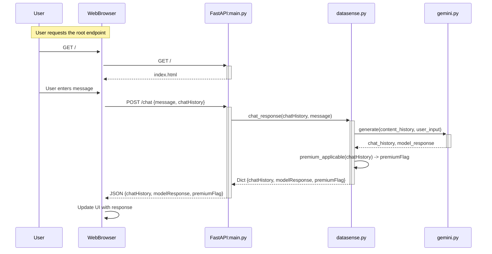
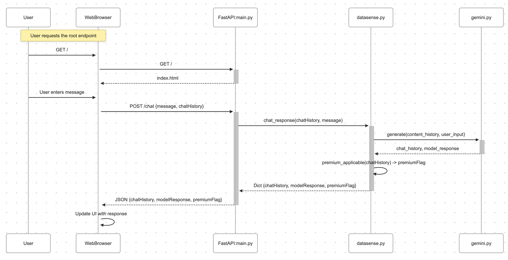

# Commands


```bash
uvicorn main:app --reload
```

# Env variables 
These are variables you can control. If the variable includes a default value, you can skip it.


GCP_PROJECT
GCP_LOCATION
SYSTEM_INSTRUCTION='You are Gemini, a helpful chat assistant'
GCP_MODEL="gemini-2.0-flash-001"
MODEL_TEMPERATURE=0.2
MODEL_TOP_P=0.8
MODEL_MAX_OUTPUT_TOKENS=1024


# Architecture





